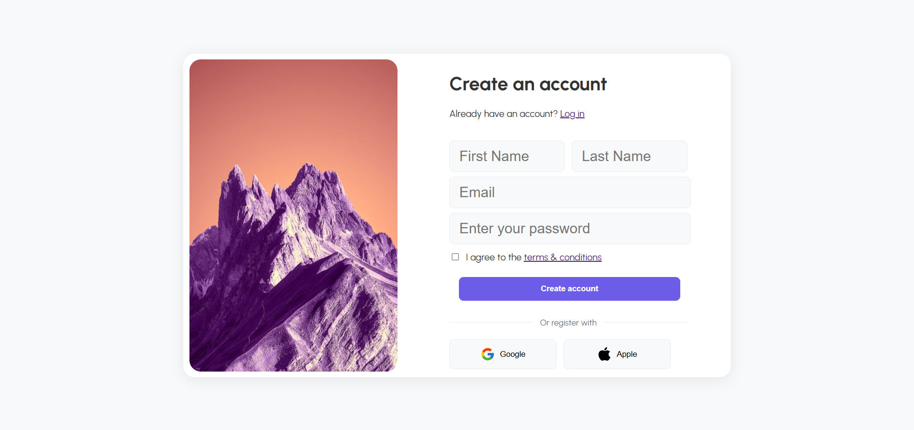

# Daily UI

## #001: Sign Up Page

Create a sign up page, modal, form, or app screen related to signing up for something. It could be for a volunteer event, contest registration, a giveaway, or anything you can image.

---
## 📸 Screenshot



## Project Structure and File Descriptions

```
index.html
README.md
images/
    card-image.png
    card-with-paper.png
    example.png
    screenshot.png
scripts/
    scripts.js
styles/
    styles.css
```

- **index.html**: The main HTML file containing the sign up form and layout structure.
- **styles/styles.css**: Contains all styles and layout rules for the modern sign up page design.
- **images/**: Folder containing images and icons used in the form.
  - `form-image.jpg`: The beautiful mountain landscape image displayed next to the form.
  - `icon-apple.svg`: Apple logo icon for Apple registration button.
  - `icon-google.svg`: Google logo icon for Google registration button.
  - `example.webp`: Example or reference image.
- **README.md**: Project description and documentation.

## Features

- ✨ **Modern Form Design**: Clean and elegant sign up form with beautiful visual elements
- 🎨 **Interactive Elements**: Focus states with purple accent colors and smooth transitions
- 📱 **Responsive Layout**: Flexbox-based layout that adapts to different screen sizes
- 🔒 **Form Validation**: Required field validation for user inputs
- 🌄 **Visual Appeal**: Stunning mountain landscape image creating an engaging user experience
- 🔘 **Social Login Options**: Quick registration with Google and Apple accounts
- ⚡ **Smooth Animations**: Hover effects and transitions for better user interaction

## Technologies Used

- HTML5
- CSS3 (with modern features like nested selectors and flexbox)
- Modern typography with Urbanist font family
- Form validation and user experience enhancements
